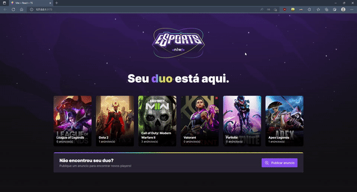

<div align="center">
  
</div>



## 💻 About the Project

Project developed during the 9th edition of the Next Level Week of Rocketseat using typescript, react.js, vite, react native, expo. This is a platform built for finding a duo to play games. 

## 🧭 Tecnologies

This project was developed using:
- [Vite](https://vitejs.dev/)
- [ReactJS](https://reactjs.org/)
- [Typescript](https://www.typescriptlang.org/)
- [React Native](https://reactnative.dev/)
- [Expo](https://expo.dev/)

<h2>
  📌 To have a copy of the project
</h2>

### Clone the repository to have a copy of the code on your machine

```bash
$ git clone https://github.com/jvictorribeiro/nlw9-eSports.git && cd nlw9-eSports
```

### Get all dependencies

<h2>
  📌 Access each folder to install dependencies and run apps
</h2>

### Run the 'frontend' server
```bash
$ cd web
$ npm install
$ npm run dev
```

The link to the app will be available for access on your terminal

### Run the 'backend' server

```bash
$ cd server
$ npm install
$ npm run dev
```

### Run expo and emulator/device(expo go)

```bash
$ expo start
```


<h3 align=center>Made by <a href="https://www.linkedin.com/in/victor-ribeiroo//">Jv</a></h3>
